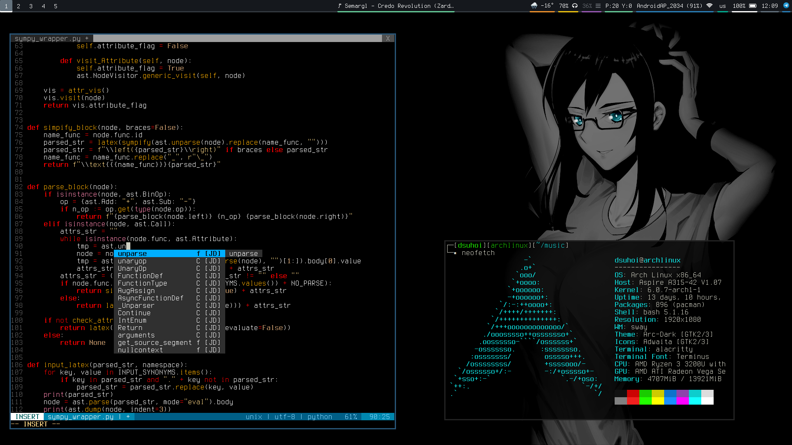

# dotfiles

> My config files.
>

### Конфигурации
- Гайд по установке ArchLinux
- Скрипт по установке основных пакетов
- Sway
- Waybar
- Alacritty
- Bash (oh-my-Bash)
- Vim
- Mutt (почта)

#### Неактульные конфигурации
- i3-gaps (и xorg)
- Polybar
- urxvt
- Emacs

### About me
- [Telegram](https://t.me/dsuh0i)
- [Email](mailto:dsuh0i.h8@gmail.com)
